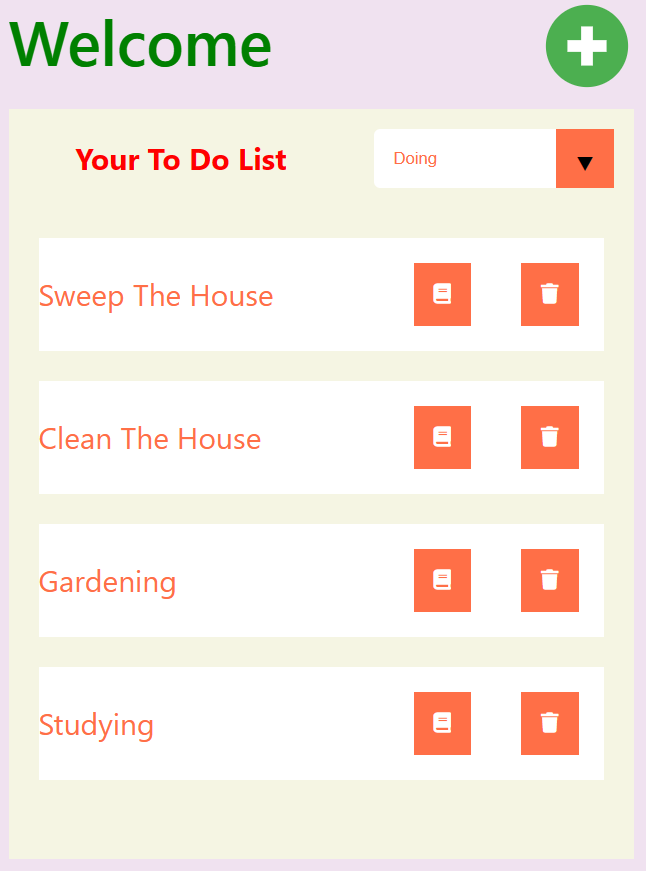
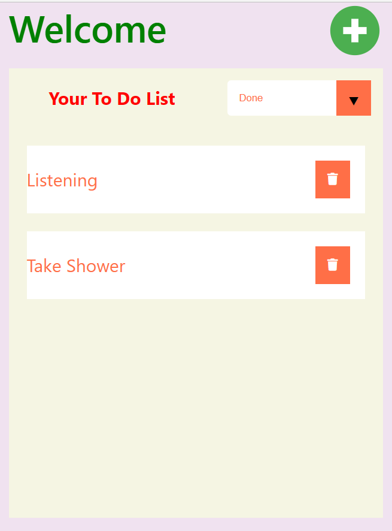

<h1>Install this Todo_list_app:</h1>

1. Clone this github respository

2. Download node in: https://nodejs.org/en/

3. Open your terminal to the folder location, type: npm install

4. Run npm run start

5. Run json server: npx json-server --watch data/todos.json --port 8000

<h1>Technologies used in this project:</h1>

Reactjs, Jsonserver, react-router-dom, javascript, html, css

<h1>Screenshot from the app:</h1>

